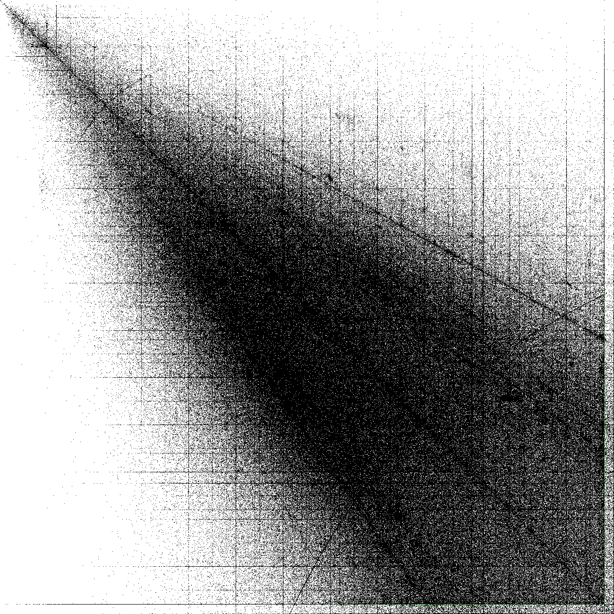

# fuzzysearch-next

A collection of software related to [FuzzySearch]. These are for exploring other
ways to approach problems and may or may not be used at some point.

[FuzzySearch]: https://github.com/Syfaro/fuzzysearch

## fuzzysearch-api

Alternative API interface with a slightly more usable interface with much more
comprehensive autogenerated documentation.

## fuzzysearch-web

An attempt at building a web interface using Yew. It performs the image hashing
on the client to increase performance.

## fuzzysearch-file-index

Tools and data processing for the millions of images on disk. This is
responsible for generating the somewhat perplexing image of all known image
dimensions.

